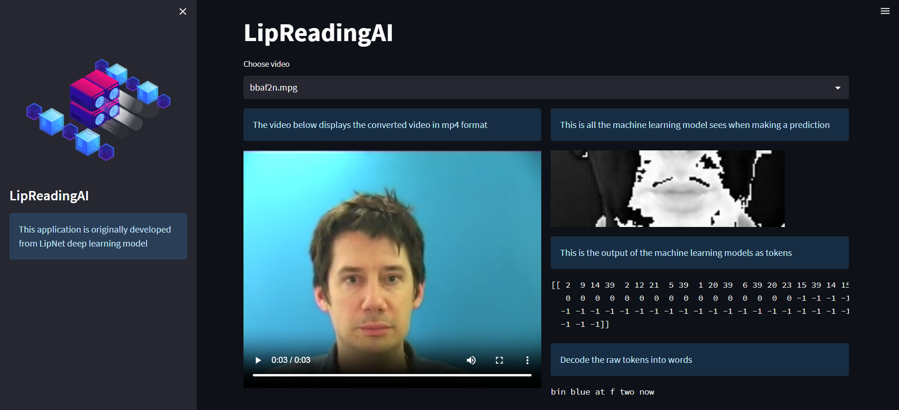

# Lip Reading App
This repository contains a lip reading app that utilizes deep learning techniques to interpret and understand spoken language from video input.

It utilizes Tensorflow to create and train the model
and Streamlit is used to build the user interface.

# Introduction
Lip reading is the process of understanding spoken language by observing the movements of a speaker's lips, face, and surrounding facial features. 

This lip reading model utilizes deep learning algorithms to analyze video input and converts the observed lip movements into text transcriptions.

# Dataset
The lip reading model is trained on an extract of the GRID dataset,     which contains videos of a speaker and their aligned transcriptions. 

# Model Architecture
This model architecture combines Conv3D, LSTM, Dense and Time Distributed layers to process lip image sequences and perform lip reading tasks.

# Result
**Example:**
In this three second clip ,the speaker mouths the words "Bin Blue at F Two Now"

